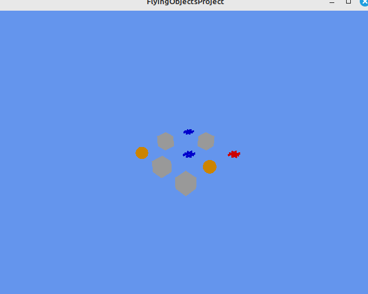

# 3D Tic Tac Toe Project

Hi there! This is my **3D Tic Tac Toe game** built with **LibGDX**. I started with a basic flying objects demo and completely transformed it into an interactive **3D Tic Tac Toe game**. The game is set in a **3x3x3 grid** where players can place marks in 3D space.

## Project Overview

In this project, I created a **3×3×3 board** where each cell shows a **3D model** representing either an X, an O, or an empty space. I built a special `TicTacToeGrid3D` class that keeps track of the board, handles placing marks, and even checks for wins or ties.

For the 3D scene:
- The **camera** is positioned closer to give a better view of the grid.
- **Ambient lighting** and **directional lighting** are used to enhance the scene.
- **ModelBatch** is responsible for rendering all the 3D models.

### Models Used
- **X (hash)** is represented by my **hash model**.
- **O (sphere)** is represented by my **sphere model**.
- **Empty cells** are shown as **cubes**.

All models and assets are included with the project.

## How to Play

1. **Moving Around the Grid:**
    - Use the **WASD** keys to move the cursor around the **3x3x3 grid**.
        - **W**: Move up (Y-axis)
        - **S**: Move down (Y-axis)
        - **A**: Move left (X-axis)
        - **D**: Move right (X-axis)
        - **Page Up**: Move forward (Z-axis)
        - **Page Down**: Move backward (Z-axis)
    - The **selected cell** is highlighted in **white** for easy visibility.

2. **Placing Your Mark:**
    - Press the **SPACE** key to place the current player’s mark (X or O) in the selected cell.
    - If the selected cell is already occupied, nothing happens.

3. **Game Rules:**
    - The game checks the **rows**, **columns**, and **diagonals** for a winner after each move.
    - If someone wins, a message is logged and the game resets.
    - If all cells are filled and there’s no winner, it’s a tie and the board resets.
    - Turns alternate between **X** and **O**, with **X** always starting first.

## 3D Grid Setup

- **3×3×3 Grid:** The game board consists of a 3x3x3 grid of cells in 3D space. Each cell is represented by a **3D model**.
- **Dynamic Model Scaling:** The models are scaled to be larger for better visibility, and the grid is closely packed for an intimate view.
- **Perspective Camera:** A **perspective camera** provides an overhead view of the grid, giving you a clear view of all the cells.

## Build and Run

To build and run the game, use **Gradle**. You can easily build, run, and test the project from your terminal or IDE. The setup is configured for seamless development.

1. Clone the repository.
2. Run the appropriate **Gradle tasks** to build and launch the game.
